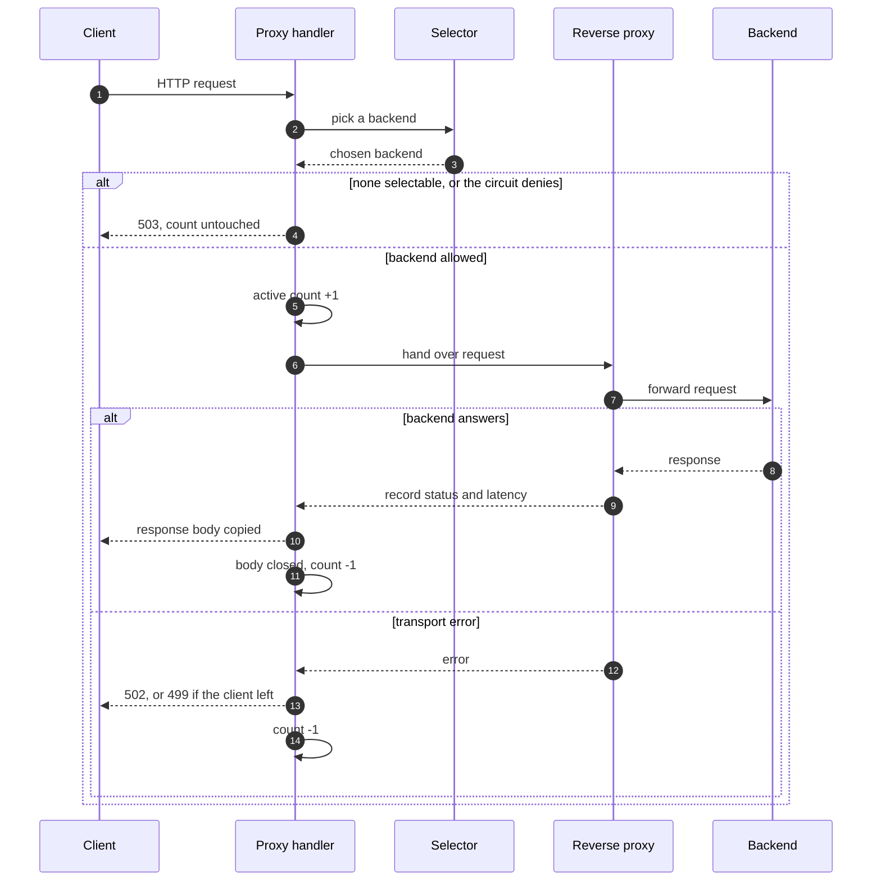

# l7LoadBalancer

A **Layer 7** load balancer in Go: it reads each HTTP request (method, path, headers) and forwards it to one of several **backends**, the servers that do the real work, through a **reverse proxy** (a component that sends a client's request to a backend and returns the response) built on `net/http/httputil`. It offers four ways to pick a backend, and it adds health checks (periodic tests of whether a backend answers), per-backend circuit breakers (a switch that stops traffic to a backend that keeps failing) and a reload that applies a new backend list in place. The repository also holds a reproducible benchmark against Nginx (a widely used web server and proxy) and a local demo, and it states the limits of both below.

## How a request flows

The **selector** applies one of the four algorithms to the healthy backends. **Round-robin** takes the backends in turn. **Least-connections** picks the backend with the fewest requests in flight. **Consistent hashing** sends the same key to the same backend. **Power of two choices** compares two random backends and takes the better one, judged by a moving average of recent latency. The **circuit** is the per-backend switch described above. The **active count** is the number of requests in flight to a backend. The numbers 503, 502 and 499 are status codes: no backend available, a failed backend call, and the client leaving first.



The [architecture document](docs/architecture.md) explains each numbered step and shows which package depends on which.

## Quickstart

Requires Go 1.25 or newer.

```sh
make build   # builds bin/l7LoadBalancer
make test    # runs all tests
make run     # builds, then serves on :8080 using configs/example.yaml
```

`make run` expects the backends listed in `configs/example.yaml` to be reachable. `make help` lists the other targets.

## Local live demo

The **local live demo** runs on your machine only. It starts four load balancers (one per algorithm) in front of four backends, sends skewed synthetic traffic, and shows the result on a Grafana dashboard (a web page of live charts). There is no public URL. An architecture decision record (ADR), [ADR-0023](docs/adr/0023-local-live-demo.md), records why.

```sh
make demo-up    # builds and starts the demo; the first build takes a few minutes
make demo-down  # stops it
```

Open the control page at `http://127.0.0.1:8095` and the dashboard at `http://127.0.0.1:3000`. With the demo up, `demo/acceptance.sh` is the acceptance check: it slows one backend, confirms that only that backend's latency rises, and confirms that the power-of-two selector then moves traffic off it. Stop the benchmark first, because the benchmark and the demo both use port 8080. [`demo/DEMO-SCRIPT.md`](demo/DEMO-SCRIPT.md) lists the scenarios to walk through.

Demo video: <!-- VIDEO-LINK-SLOT: owner fills in after recording -->

## Headline results

**Units.** `req/s` means requests per second. `s` means seconds. `ms` means milliseconds. `GiB` is gibibytes of memory. A load such as "30% load" means 30% of that scenario's peak rate. The median is the latency that half of the requests beat. `B`, `KiB` and `MiB` are bytes, kibibytes (1024 bytes) and mebibytes (1024 KiB), here the size of each response. **p99** is the latency that 99 of every 100 requests stayed under. A **peak** is the highest request rate a proxy sustained: p99 under 100 ms, fewer than 1% of requests failing, and the load generator (the program that sends the test requests) delivering at least 95% of the requested rate. The benchmark raises the rate in steps, so a peak is accurate only to its step. Full figures, method and caveats are in [`RESULTS.md`](RESULTS.md). In that file, the "Time to detection" column measures the width of the error window (last failed request minus first), not the delay before the failure was noticed.

**How far to trust the numbers.**

- One uninterrupted run from commit `8c2b7d4` produced 67 of 71 result sets, and its tracking entry flags it as noisy and incomplete. Two scenarios, round-robin through the load balancer over HTTP/2 (a newer HTTP version that sends many requests over one connection) at 200 B and 10 KiB responses, were skipped.
- The rig, the test machine and its setup, was an Apple M3 with 8 virtual CPUs and 8 GiB of memory assigned to Docker. The load balancer and Nginx each had two pinned cores, each backend one, and the load generator two. Pinned means each program ran only on its assigned cores. The cores sit inside a virtual machine, so the throughput ceiling is soft.
- Peaks for large responses are **rig-limited**: the load generator, not the proxy, set the limit. Treat them as lower bounds.

**Nginx comparison, HTTP/1.1, round-robin.** Both sides ran round-robin, so the comparison is **matched**. Over HTTP/1.1, Nginx is ahead at all three response sizes, and the HTTP/2 round-robin comparison at 200 B and 10 KiB is absent because the load-balancer scenarios there were skipped. Single run, ordinal claim only: the claim gives the order, not a ratio.

| Response size | Nginx peak (req/s) | Load balancer peak (req/s) | Gap (req/s) | Search step (req/s) |
|---|---|---|---|---|
| 200 B | 11500 | 8000 | 3500 | 500 |
| 10 KiB | 6000 | 4500 | 1500 | 500 |
| 1 MiB | 350 | 275 | 75 | 25 |

Every gap is larger than its step.

**Reload under load.** A **reload** applies a new configuration to the running process when it receives the `SIGHUP` signal. A reload that removes a backend **drains** it: the backend finishes its in-flight requests and takes no new ones. Under 60 s of steady HTTP/2 round-robin load  a reload with an unchanged configuration and a reload that removed a backend both passed, with no non-2xx responses (status codes outside 200–299) and no transport errors (failed connections to a backend). The removed backend received no further requests after the reload applied. This was one run each, round-robin only.

**Stopping a backend mid-run.** One of four backends was stopped gracefully at second 29 of a 60 s run. The target was 1750 req/s over HTTP/2 with 10 KiB responses, and the generator delivered about 1210 req/s on average. Three requests failed, all within a 9 ms span that began about 0.7 s after the stop. The load balancer never retries ([ADR-0018](docs/adr/0018-no-retry-ever.md)), so those three reached the client.

**Hot keys.** A **hot key** is a hash key that carries a disproportionate share of requests. **Consistent hashing** maps each key to a backend so that the same key reaches the same backend. **Bounded loads** limit how much a backend may take and send the excess to the next one. The benchmark's load generator has one address, so every request is a hot key. 

- In every Nginx result of the main HTTP/2 runs, whose hashing has no bound, at least 97.97% of requests landed on one backend.
- The load balancer spilled in the same size and load combinations. At 10 KiB peak load, 82.27% went to the backend the key maps to and 17.19% to a second backend.
- At 1 MiB and 30% load no spill occurred. Arithmetic explains that, and it was not measured: the capacity rule in [ADR-0009](docs/adr/0009-consistent-hash-bounded-loads-capacity-and-evidence.md) never allows less than one request in flight, and at about 60 req/s with a latency near 8 ms the average is about 0.5 (arrival rate times latency).

**Degraded backend.** The scenario that slows one backend is unreliable and is not quoted. Every median sat near the injected 50 ms, which is consistent with the delay reaching all four backends. The suspected cause, an exported environment variable leaking through a shared Docker Compose definition (the file that lists the containers), is UNVERIFIED.

## Dependencies

**h2c** is HTTP/2 without encryption.

Built on `net/http/httputil`. Third-party: `x/net/http2` (h2c and HTTP/2 to backends), `client_golang` (metrics), `yaml.v3` (config).

## AI-assisted development

<!-- AI-DISCLOSURE-SLOT: owner writes this section -->

## Read more

- [Design decisions](docs/design-decisions.md): seven topics, each with its problem, options, choice and cost.
- [What I'd do differently](docs/what-id-do-differently.md): the project's known weaknesses, each with a source.
- [Architecture](docs/architecture.md): the request path and the package dependencies.
- [ADR index](docs/adr/INDEX.md): every architecture decision record, one line each.
- [Benchmark results](RESULTS.md): the full tables and limitations. Its "Time to detection" column measures the width of the error window.

## Licence

MIT. See [`LICENSE`](LICENSE).
